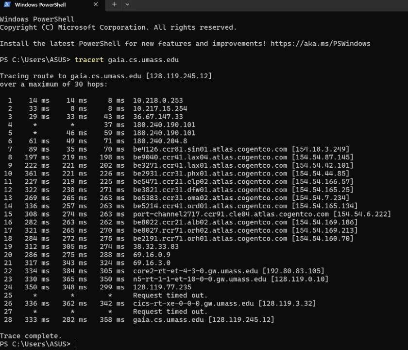
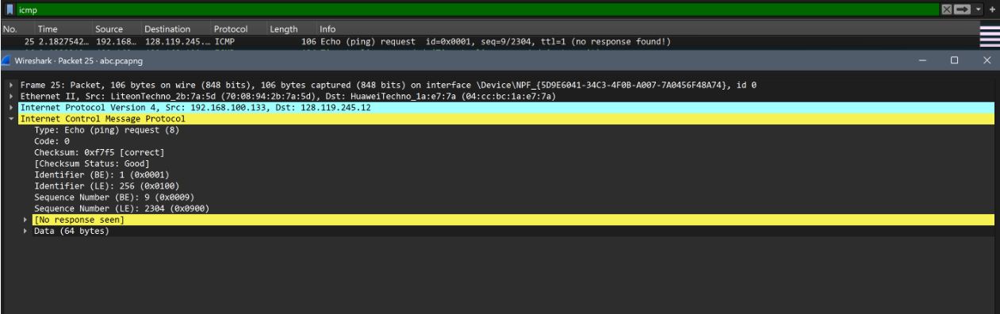
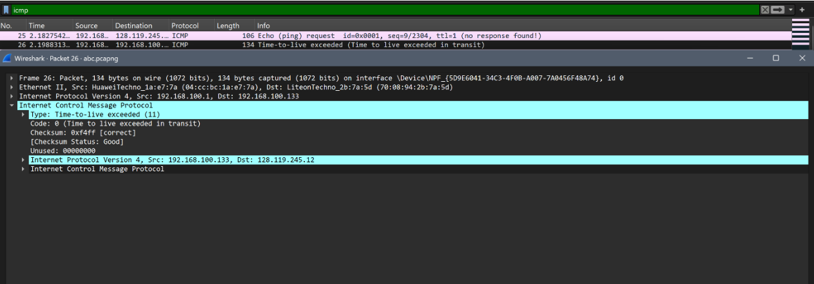
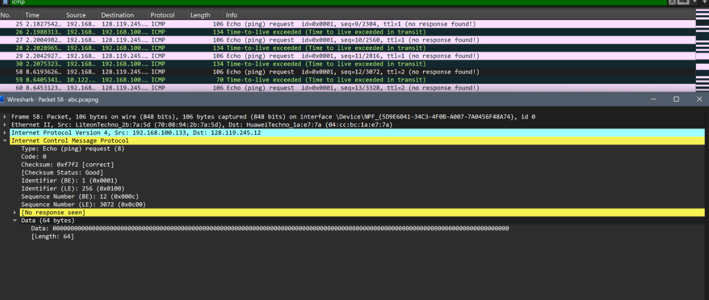

# Laporan Praktikum Modul 10 

## Menangkap paket dari eksekusi traceroute

Dilakukan pengujian untuk memetakan rute perjalanan paket data dari perangkat lokal menuju server gaia.cs.umass.edu[cite: 1]. Pengujian ini dilakukan menggunakan utility bawaan Windows yaitu tracert[cite: 1].

## IPv4 Dasar

Menerapkan filter icmp pada Wireshark[cite: 1]. Filter ini menampilkan rangkaian paket Echo Request yang dikirim oleh host dan paket Time-to-live exceeded yang dikirim kembali oleh router perantara[cite: 1].

Pada gambar di atas, terlihat bahwa laptop mengirimkan Echo Request dengan nilai TTL=1[cite: 1]. Hal ini dilakukan agar paket kadaluwarsa tepat di router pertama, sehingga memicu router tersebut untuk mengirimkan respon identitasnya[cite: 1].

Pada gambar di atas, terdeteksi balasan dari router dengan IP 192.168.100.1[cite: 1]. Paket ini memiliki protokol ICMP dengan Type: 11 (Time-to-live exceeded), yang mengonfirmasi bahwa router tersebut telah membuang paket No. 25 dan melaporkan keberadaannya kembali ke host pengirim[cite: 1].

Untuk memetakan rute selanjutnya, laptop otomatis menaikkan nilai TTL menjadi 2 seperti pada gambar di atas[cite: 1]. Dengan TTL=2, paket dapat melewati hop pertama dan mencapai hop kedua (10.122.x.x), yang kemudian memberikan respon serupa untuk mengidentifikasi rute berikutnya[cite: 1].

## IPv6 

Melihat sekilas datagram IPv6 menggunakan Wireshark[cite: 1].

Berdasarkan gambar di atas, berbeda dengan IPv4, alamat sumber (Source Address) dan tujuan (Destination Address) pada IPv6 menggunakan format heksadesimal yang jauh lebih panjang (128-bit)[cite: 1]. Selain itu, bidang Time to Live (TTL) pada IPv4 kini diganti namanya menjadi Hop Limit[cite: 1].

Sehingga dapat disimpulkan bahwa header IPv6 terlihat lebih "bersih" dibandingkan IPv4 karena beberapa bidang (seperti Header Checksum dan Fragmentation fields) telah dihilangkan atau dipindahkan ke extension header[cite: 1]. Hal ini meminimalkan beban pemrosesan pada router perantara sehingga proses routing di internet menjadi lebih cepat dan efisien[cite: 1].

## Kesimpulan
Mekanisme pelacakan jalur (route tracing) sangat bergantung pada manipulasi kolom TTL (pada IPv4) atau Hop Limit (pada IPv6)[cite: 1]. Penggunaan protokol ICMP sebagai pembawa pesan kesalahan (Type 11) memungkinkan perangkat pengirim untuk memetakan setiap hop hingga mencapai tujuan[cite: 1]. Selain itu, pengamatan pada IPv6 menunjukkan adanya evolusi desain header yang lebih efisien untuk menangani trafik jaringan modern yang lebih masif[cite: 1].