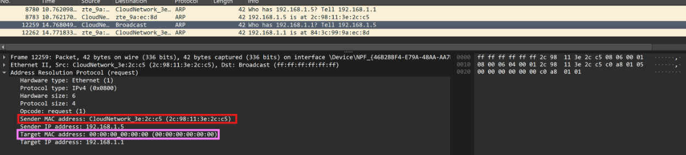
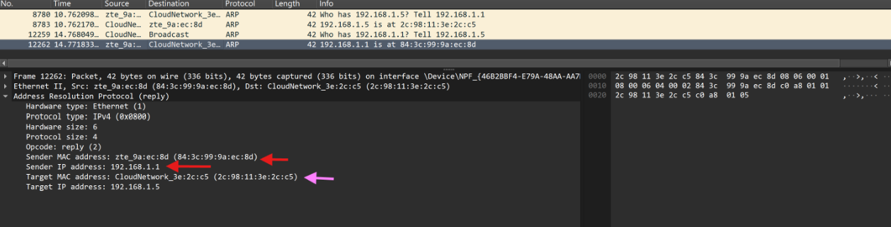

# LAPORAN PRAKTIKUM MODUL 13

## Caching ARP
ARP caching berfungsi untuk menyimpan sementara hasil pemetaan antara alamat IP dan alamat MAC yang telah diperoleh melalui proses ARP[cite: 3]. Dengan adanya cache, host tidak perlu mengirim ARP Request setiap kali akan berkomunikasi dengan perangkat yang sama sehingga komunikasi menjadi lebih cepat dan efisien[cite: 3].

Untuk memulai, langkah pertama yang diperlukan adalah menghapus cache ARP:
- Untuk **MS-DOS** gunakan perintah `arp -d *`. Bendera `-d` mengindikasikan operasi penghapusan, dan `*` adalah wildcard untuk menghapus semua entri tabel[cite: 3].
- Untuk **Linux/Unix/MacOS** gunakan perintah `arp -d *` (diperlukan hak akses root)[cite: 3].

## Mengamati Aksi ARP
Langkah pengamatan dilakukan dengan menyalakan Wireshark, memfilter protokol "ARP", dan mengakses URL target untuk mengamati proses pemetaan alamat[cite: 3].

Pilih paket dengan Destination **Broadcast**:

*   **Analisis ARP Request**: MAC address tujuan bernilai `00:00:00:00:00:00` karena belum diketahui[cite: 3]. Paket dikirim secara broadcast (`ff:ff:ff:ff:ff:ff`) ke seluruh perangkat dalam jaringan lokal untuk mencari host dengan IP `192.168.1.1`[cite: 3].

Pilih paket 12262:

*   **Analisis ARP Reply**: IP `192.168.1.1` dipetakan dengan MAC address `84:3c:99:9a:ec:8d`[cite: 3]. Balasan ini dikirim langsung kepada host penanya (`192.168.1.5`), mengonfirmasi pemetaan alamat tersebut[cite: 3].

## 📝 Kesimpulan
Protokol ARP digunakan untuk menerjemahkan alamat IP menjadi alamat MAC pada jaringan lokal[cite: 3]. Ketika host belum mengetahui MAC address dari suatu IP, host akan mengirimkan ARP Request secara broadcast[cite: 3]. Informasi pemetaan yang diperoleh kemudian disimpan dalam ARP cache untuk mempercepat komunikasi berikutnya[cite: 3].