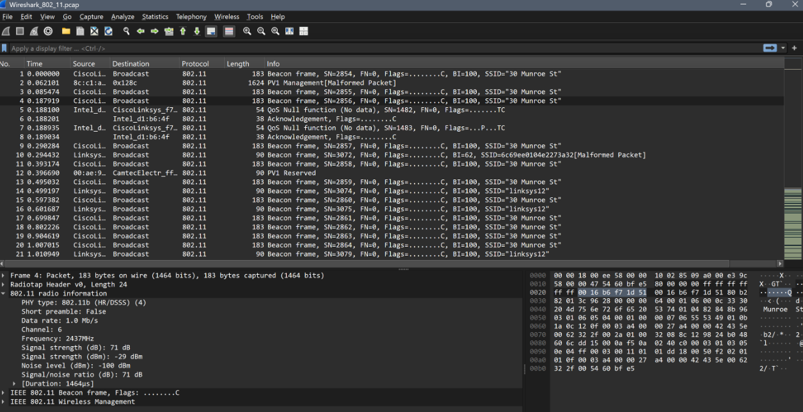
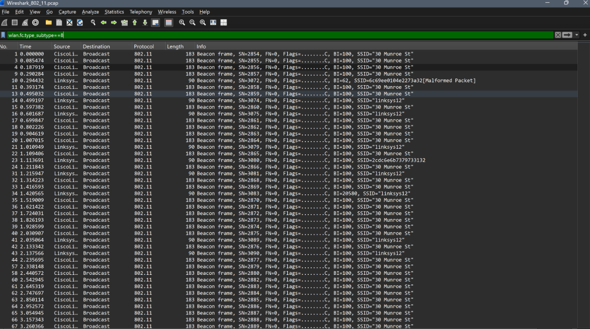
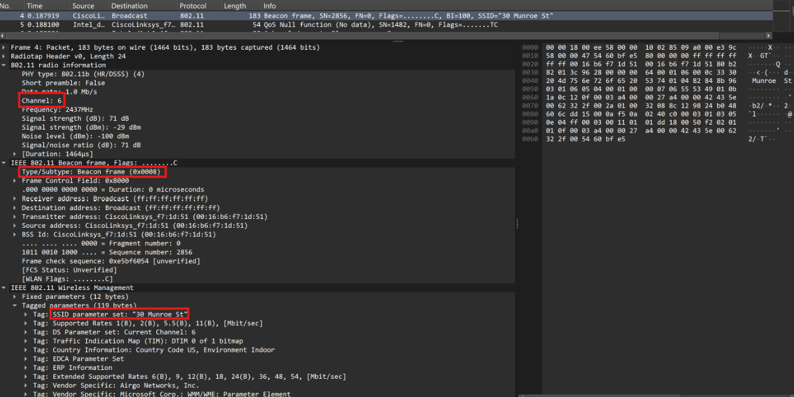
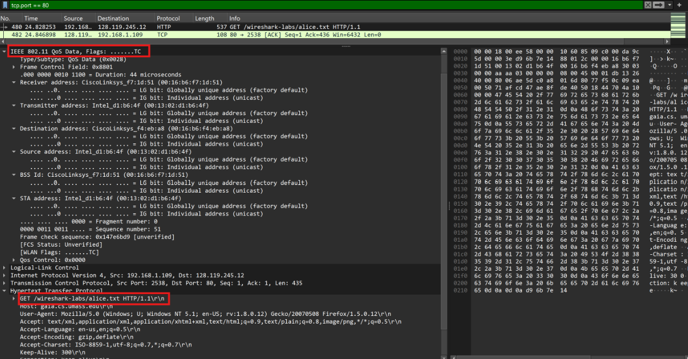
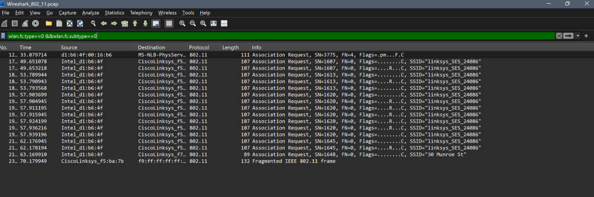
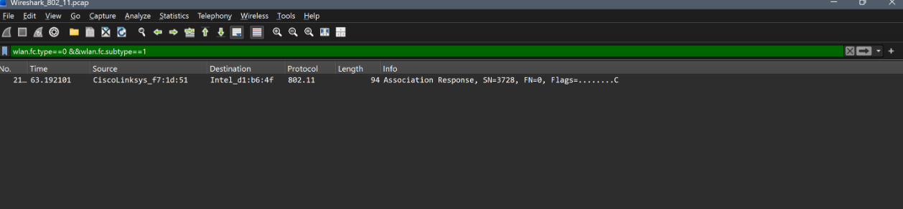
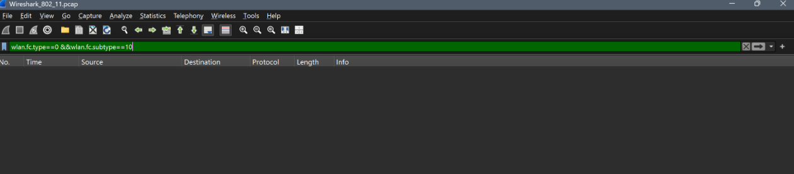

## **LAPORAN PRAKTIKUM MODUL 14**

## WiFi
Wireless Fidelity (WiFi) merupakan teknologi jaringan nirkabel yang menggunakan standar IEEE 802.11 untuk memungkinkan perangkat berkomunikasi tanpa menggunakan media kabel. Dalam jaringan WiFi, komunikasi dilakukan melalui berbagai jenis frame, seperti beacon frame, data frame, serta frame asosiasi dan disasosiasi yang berfungsi untuk mengatur proses koneksi antara perangkat pengguna dan access point.
 

## Starting 
Setelah download file zip http://gaia.cs.umass.edu/wireshark-labs/wireshark-traces.zip dan ekstrak file 
Wireshark_802_11.pcap, file tersebut dibuka menggunakan aplikasi Wireshark.
 

Berikut Tampilan yang dihasilkan:

 

## Beacon Frames
Beacon Frame merupakan frame manajemen pada protokol IEEE 802.11 yang dikirim secara berkala oleh Access Point (AP) untuk mengumumkan keberadaannya kepada perangkat di sekitarnya. Frame ini berisi informasi penting mengenai jaringan WiFi, seperti SSID (nama jaringan), channel yang digunakan, kemampuan jaringan, dan parameter lainnya yang diperlukan perangkat sebelum melakukan koneksi. Dengan adanya Beacon Frame, perangkat dapat mendeteksi jaringan WiFi yang tersedia dan melakukan proses asosiasi dengan Access Point yang dipilih.
 

Gunakan filter "wlan.fc.type_subtype==8" untuk secara spesifik hanya menampilkan Beacon frames:

 

Lalu, pilih satu paket yang ada untuk melihat detail:

Berdasarkan gambar di atas, diketahui bahwa paket tersebut merupakan Beacon Frame dengan Type/Subtype 0x0008 yang dikirim oleh Access Point (AP) untuk mengumumkan keberadaan jaringan kepada perangkat di sekitarnya. Dari informasi yang terdapat pada frame tersebut, diperoleh bahwa AP menggunakan SSID "30 Munroe St" dan beroperasi pada Channel 6. Selain itu, Beacon Frame juga memuat berbagai parameter jaringan lainnya, seperti Supported Rates hingga 54 Mbit/s serta informasi kode negara (US, Indoor) yang digunakan untuk mendukung proses komunikasi dan konfigurasi jaringan nirkabel.

## Data Transfer 
Data Transfer adalah proses pengiriman dan penerimaan data dari satu perangkat ke perangkat lain melalui suatu media komunikasi jaringan, baik kabel maupun nirkabel. Dalam jaringan WiFi (IEEE 802.11), data transfer terjadi setelah perangkat berhasil terhubung ke Access Point, sehingga berbagai informasi seperti permintaan web, file, gambar, atau data aplikasi dapat dikirim dan diterima.
Untuk menganalisis proses data transfer, gunakan filter "tcp.port == 80" guna menampilkan lalu lintas HTTP:

Berdasarkan gambar di atas, terlihat bahwa host dengan alamat IP 192.168.1.109 mengirimkan permintaan HTTP (HTTP GET) untuk mengakses file alice.txt yang berada pada server 128.119.245.12 (gaia.cs.umass.edu). Informasi tersebut terlihat pada bagian Hypertext Transfer Protocol, yaitu "GET /wireshark-labs/alice.txt HTTP/1.1." Selain itu, pada panel detail paket terlihat bahwa data HTTP tersebut dienkapsulasi dalam IEEE 802.11 QoS Data Frame, yang menunjukkan bahwa proses Data Transfer berlangsung melalui jaringan WiFi setelah host berhasil terhubung dengan Access Point.

## Association/Disassociation 
Association merupakan proses ketika sebuah host atau perangkat klien meminta izin untuk bergabung dengan suatu Access Point (AP), sedangkan Disassociation merupakan proses pemutusan hubungan antara host dan Access Point. Dalam protokol IEEE 802.11, proses association dilakukan menggunakan frame Association Request dan Association Response yang termasuk ke dalam kategori management frame.
Untuk menganalisis proses Association, gunakan filter "wlan.fc.type==0 && wlan.fc.subtype==0(Subtype 0 merujuk pada Association Request)" seperti pada gambar di bawah ini:

Pada gambar di atas, ditemukan beberapa frame Association Request yang dikirim host ke Access Point dengan SSID "linksys_SES_24086". Banyaknya frame yang dikirim menunjukkan bahwa host melakukan beberapa kali percobaan asosiasi namun tidak memperoleh respons yang sesuai.

Lalu, gunakan filter "wlan.fc.type==0 && wlan.fc.subtype==1(Subtype 1 merujuk pada Association Response)" seperti pada gambar di bawah ini:

Pada gambar di atas, terlihat satu frame Association Response yang dikirim oleh Access Point 30 Munroe St kepada host sebagai balasan atas Association Request yang diterima. Frame ini menunjukkan bahwa proses asosiasi antara host dan Access Point berhasil dilakukan.

Kemudian, gunakan filter "wlan.fc.type==0 && wlan.fc.subtype==10(Subtype 10 merujuk pada Disassociation frame)" seperti pada gambar di bawah ini:

Pada gambar di atas, tidak ditemukan paket apapun yang menunjukkan bahwa tidak ada Disassociation frame yang tertangkap dalam jejak tersebut.
 

## 📝 Kesimpulan
Berdasarkan hasil praktikum, dapat disimpulkan bahwa Wireshark dapat digunakan untuk menganalisis komunikasi pada jaringan WiFi berbasis standar IEEE 802.11. Melalui pengamatan terhadap file Wireshark_802_11.pcap, berhasil diidentifikasi berbagai jenis frame, yaitu Beacon Frame, Data Frame, serta Association dan Disassociation . Beacon Frame digunakan oleh Access Point untuk mengiklankan informasi jaringan seperti SSID dan channel, sedangkan Data Frame digunakan untuk mentransmisikan data pengguna, yang pada praktikum ini ditunjukkan oleh permintaan HTTP terhadap file alice.txt. Selain itu, proses asosiasi antara host dan Access Point juga dapat diamati melalui pertukaran frame Association Request dan Association Response. Hasil analisis menunjukkan bahwa host sempat melakukan beberapa kali percobaan asosiasi ke jaringan linksys_SES_24086, namun akhirnya berhasil terhubung kembali ke Access Point 30 Munroe St. Dengan demikian, praktikum ini memberikan pemahaman mengenai mekanisme komunikasi dan pengelolaan koneksi pada jaringan WiFi IEEE 802.11.