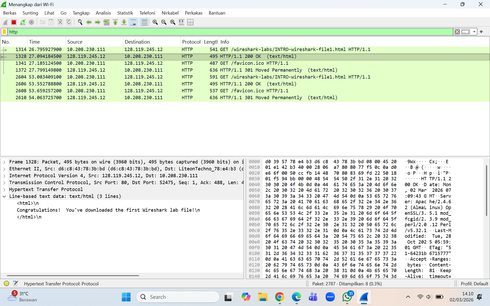

# Laporan Praktikum Jaringan Komputer
## Modul 2 - Pengenalan Tools

## Tujuan Praktikum
1. Mahasiswa dapat melakukan instalasi tools yang digunakan pada saat praktikum, yaitu Wireshark.
2. Mahasiswa dapat menggunakan Wireshark untuk meng-capture dan mengidentifikasi paket data pada jaringan.

---

## Dasar Teori
Wireshark merupakan sebuah aplikasi *packet analyzer* yang digunakan untuk menangkap dan menganalisis paket data yang melewati suatu jaringan. pengguna dapat melihat berbagai informasi terkait paket jaringan seperti alamat sumber, alamat tujuan, protokol yang digunakan, serta isi dari paket tersebut.

Packet sniffer bekerja secara *pasif* yang dimana aplikasi ini hanya menangkap dan menampilkan paket yang dikirim atau diterima oleh komputer tanpa mengubah isi paket tersebut. Informasi paket yang tertangkap biasanya terdiri dari beberapa lapisan protokol seperti Ethernet, IP, TCP/UDP, dan protokol aplikasi seperti HTTP.

Wireshark memiliki beberapa bagian utama pada tampilannya, yaitu:
- **Command Menu** : menu utama untuk mengatur berbagai fungsi Wireshark.
- **Packet List Window** : menampilkan daftar paket yang berhasil ditangkap.
- **Packet Details Window** : menampilkan detail informasi dari paket yang dipilih.
- **Packet Contents Window** : menampilkan isi paket dalam bentuk ASCII atau heksadesimal.
- **Display Filter** : digunakan untuk memfilter paket berdasarkan protokol tertentu.

Dengan menggunakan Wireshark, pengguna dapat mempelajari bagaimana protokol jaringan bekerja secara langsung dengan melihat paket yang sedang ditransmisikan.

---

## Percobaan

1. install aplikasi *Wireshark* pada komputer/laptop.
2. jalankan aplikasi Wireshark.
3. pilih interface jaringan yang digunakan (misalnya WiFi atau Ethernet).
4. mulai proses *capture packet* dengan menekan tombol *Start*.
5. Membuka browser dan mengakses halaman berikut:
   "http://gaia.cs.umass.edu/wireshark-labs/INTRO-wireshark-file1.html"  
6. hentikan proses capture pada Wireshark setelah halaman berhasil dimuat.
7. Menggunakan *display filter* dengan mengetikkan:
   "http"
untuk menampilkan paket HTTP saja.

8. Mengamati paket HTTP GET yang dikirim dari komputer ke server.
9. Mengamati detail paket pada bagian **packet details**.
10. Menutup aplikasi Wireshark setelah selesai melakukan pengamatan.

## Hasil
Dari proses capture yang dilakukan menggunakan Wireshark, terlihat bahwa beberapa paket jaringan berhasil ditangkap oleh aplikasi. Paket-paket tersebut terdiri dari berbagai protokol seperti TCP, DNS, dan HTTP.

Setelah menggunakan filter **http**, hanya paket HTTP yang ditampilkan pada daftar paket. Terlihat adanya pesan **HTTP GET** yang dikirim oleh browser ke server dan **HTTP Response** yang dikirim kembali oleh server ke browser.

Pada bagian detail paket juga terlihat struktur protokol yang berlapis, yaitu:
- Frame Ethernet
- Internet Protocol (IP)
- Transmission Control Protocol (TCP)
- Hypertext Transfer Protocol (HTTP)

Hal ini menunjukkan bahwa komunikasi web menggunakan beberapa lapisan protokol dalam proses pengiriman data.

---

## Analisa
Berdasarkan percobaan yang dilakukan, Wireshark dapat digunakan untuk melihat aktivitas jaringan secara detail. Ketika browser mengakses sebuah halaman web, komputer akan mengirimkan permintaan HTTP GET ke server. Server kemudian merespon dengan mengirimkan data halaman web kepada client.

Selain paket HTTP, ada juga paket lain yang ikut tertangkap seperti DNS dan TCP karena komunikasi jaringan tidak hanya melibatkan satu protokol saja. Dengan adanya fitur filter pada Wireshark, pengguna dapat dengan mudah memfokuskan analisis pada protokol tertentu.

---

## Kesimpulan

1. Wireshark merupakan tools yang dapat digunakan untuk menangkap dan menganalisis paket jaringan.
2. Paket yang dikirim melalui jaringan terdiri dari beberapa lapisan protokol seperti Ethernet, IP, TCP, dan HTTP.
3. Dengan menggunakan fitur filter pada Wireshark, pengguna dapat menampilkan paket berdasarkan protokol tertentu.
4. Praktikum ini membantu memahami gimana komunikasi jaringan terjadi secara nyata melalui proses pertukaran paket data.