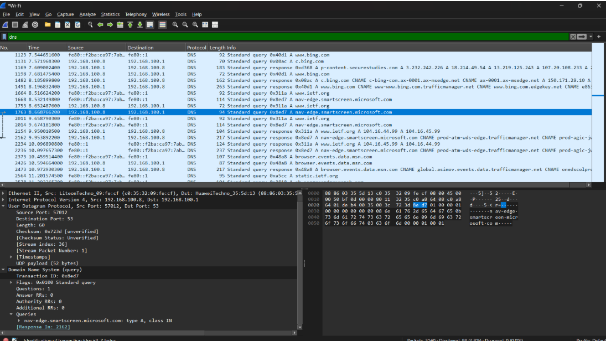
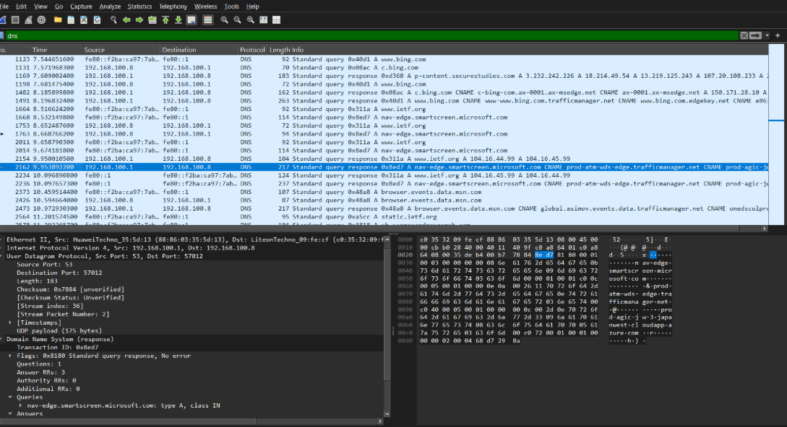
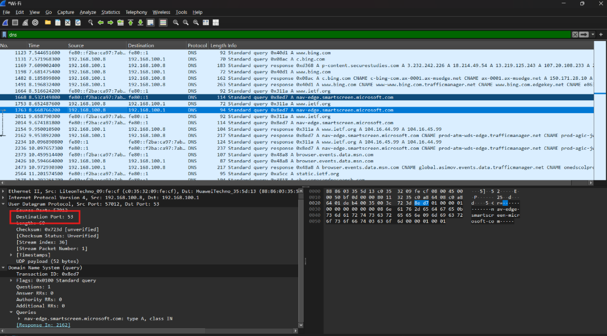
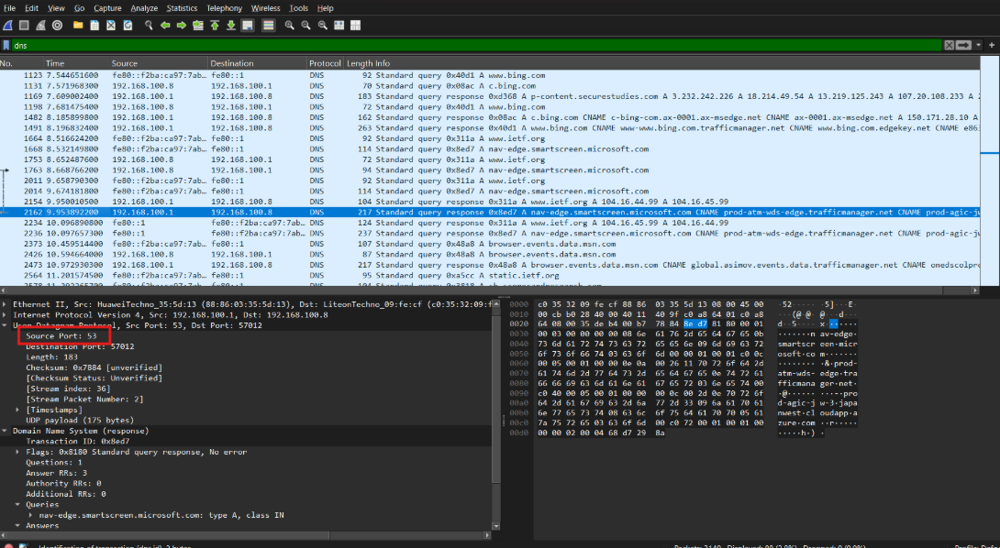
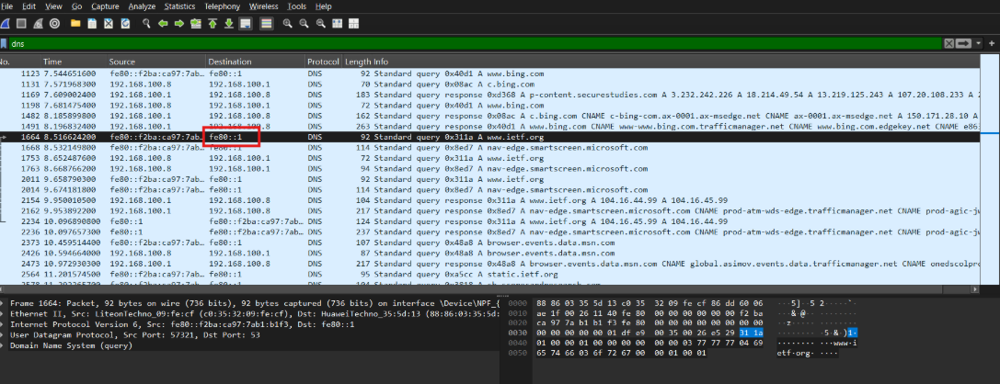
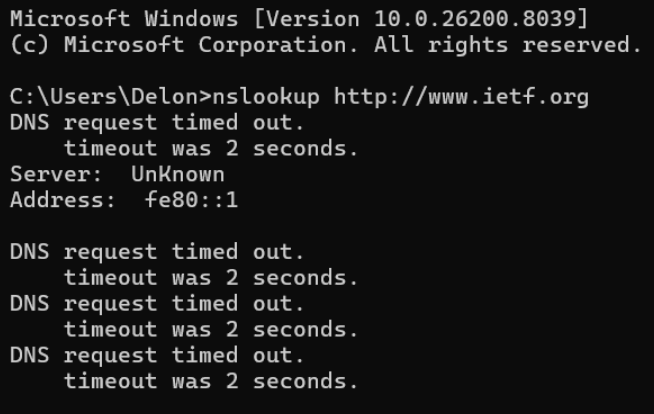
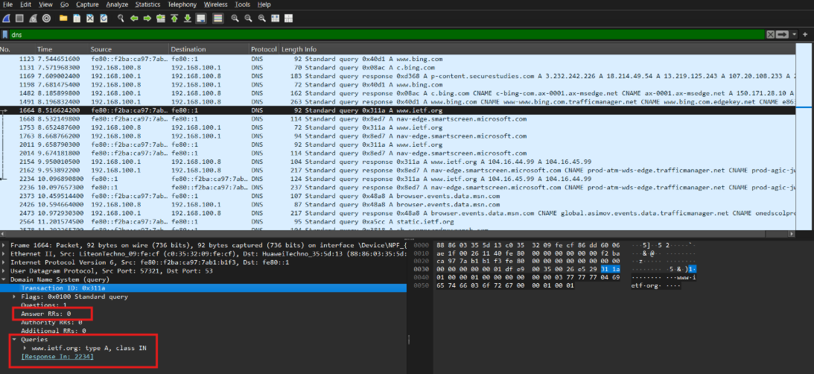
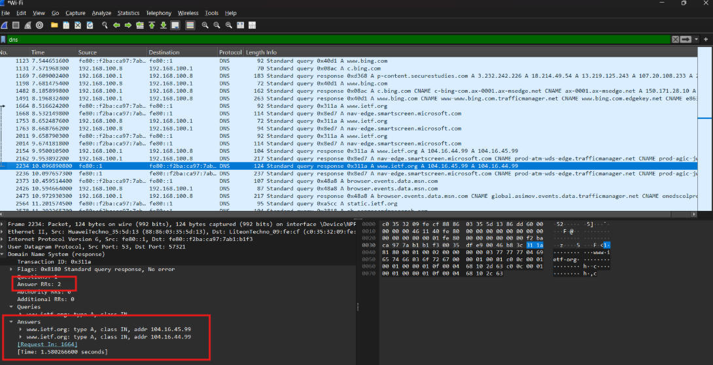

# LAPORAN PRAKTIKUM JARINGAN KOMPUTER  

## MODUL 4
## Pertanyaan

1. Cari pesan permintaan DNS dan balasannya. Apakah pesan tersebut dikirimkan melalui UDP atau TCP?
2. Apa port tujuan pada pesan permintaan DNS? Apa port sumber pada pesan balasannya?
3. Pada pesan permintaan DNS, apa alamat IP tujuannya? Apa alamat IP server DNS lokal anda (gunakan ipconfig untuk mencari tahu)? Apakah kedua alamat IP tersebut sama?
4. Periksa pesan permintaan DNS. Apa “jenis” atau ”type” dari pesan tersebut? Apakah pesan permintaan tersebut mengandung ”jawaban” atau ”answers”?
5. Periksa pesan balasan DNS. Berapa banyak ”jawaban” atau ”answers” yang terdapat di dalamnya? Apa saja isi yang terkandung dalam setiap jawaban tersebut?
6. Perhatikan paket TCP SYN yang selanjutnya dikirimkan oleh host Anda. Apakah alamat IP pada paket tersebut sesuai dengan alamat IP yang tertera pada pesan balasan DNS?
7. Halaman web yang sebelumnya anda akses (http://www.ietf.org) memuat beberapa gambar. Apakah host Anda perlu mengirimkan pesan permintaan DNS baru setiap kali ingin mengakses suatu gambar?

----

## Jawaban

1. 
   
   
   Pesan tersebut dikirimkan melalui UDP

2.  
   
   
   Port tujuan pada pesan permintaan DNS adalah 53. Port sumber pada pesan balasannya adalah 53.

3.  
   
   

4.  
   
   Jenis atau type dari pesan tersebut adalah A (Host Address). Pesan permintaan tersebut tidak mengandung jawaban atau answers.
   
5.  
   
   Terdapat 2 Jawaban

7. jawabannya adalah tidak. Host Anda tidak perlu mengirimkan pesan permintaan DNS baru setiap kali ingin mengakses suatu gambar, karena gambar-gambar tersebut biasanya berada di server yang sama dengan halaman web utama, sehingga alamat IP yang diperlukan sudah diketahui dari permintaan DNS sebelumnya.