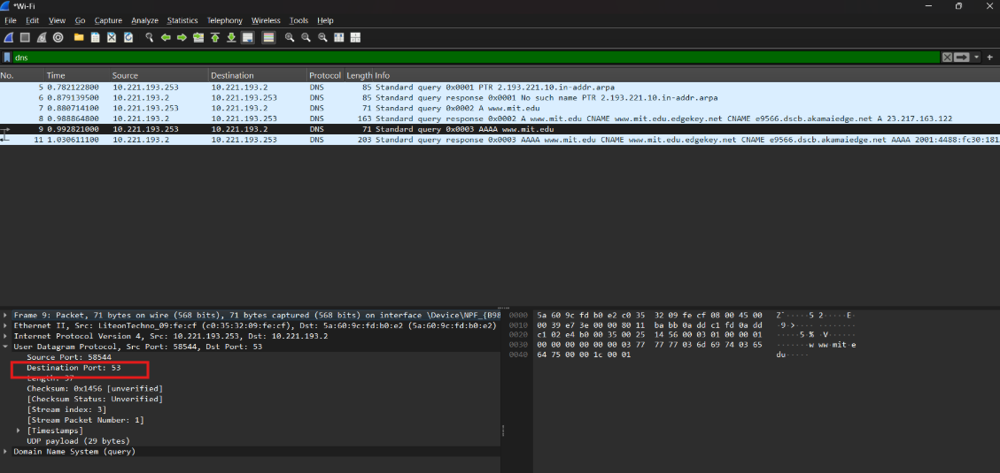
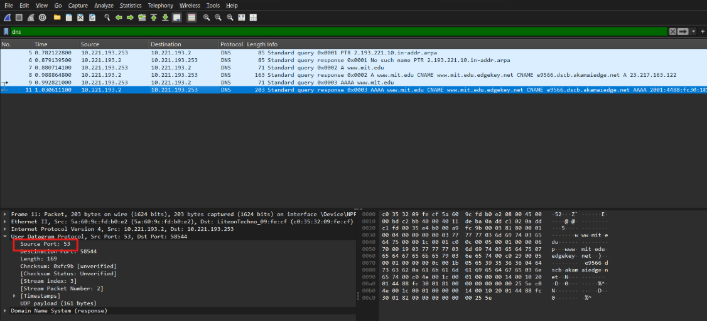
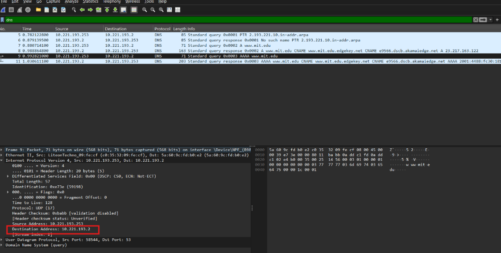
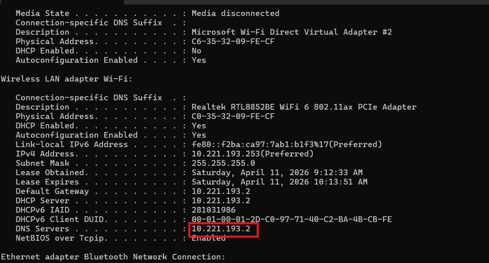
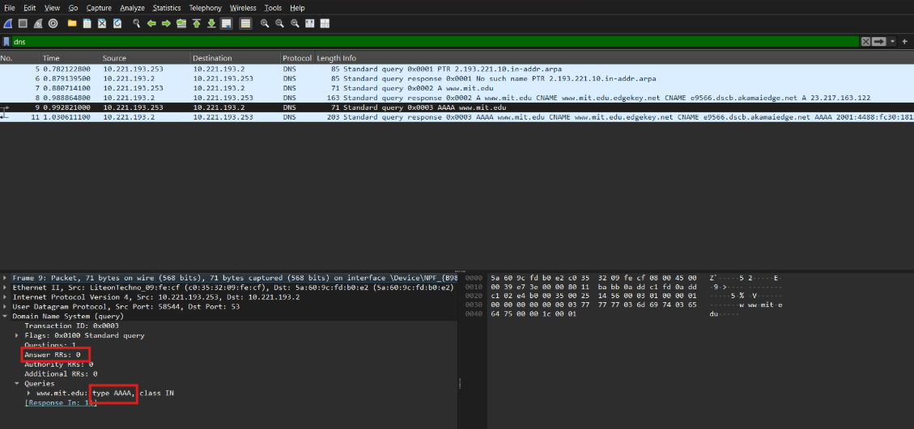
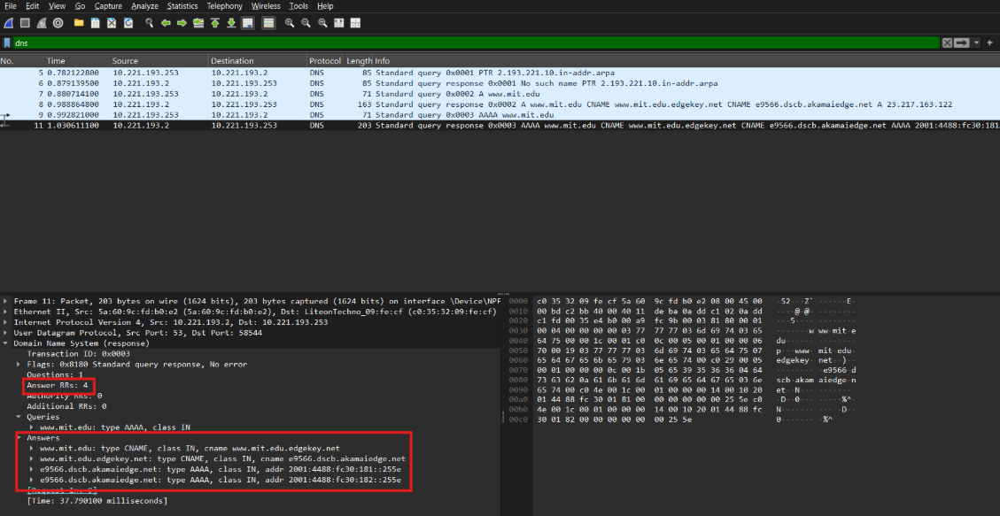

# LAPORAN PRAKTIKUM JARINGAN KOMPUTER  

## MODUL 4

## Pertanyaan

1. Apa port tujuan pada pesan permintaan DNS? Apa port sumber pada pesan balasan DNS?
2. Ke alamat IP manakah pesan permintaan DNS dikirimkan? Apakah alamat IP tersebut merupakan default alamat IP server DNS lokal Anda?
3. Periksa pesan permintaan DNS. Apa ”jenis” atau ”type” dari pesan tersebut? Apakah pesan tersebut mengandung ”jawaban” atau ”answers”?
4. Periksa pesan balasan DNS. Berapa banyak ”jawaban” atau “answers” yang terdapat di dalamnya. Apa saja isi yang terkandung dalam setiap jawaban tersebut?

----

## Jawaban :
1.  
   
   
Port tujuan pada pesan permintaan DNS adalah 53. Port sumber pada pesan balasan DNS adalah 53.

---

2. 
   
   
Pesan permintaan DNS dikirimkan ke alamat IP 10.221.193.2. Alamat IP tersebut merupakan default alamat IP server DNS lokal saya.

---

3.
   
Jenis atau type dari pesan tersebut adalah AAAA. Pesan tersebut tidak mengandung jawaban atau answers.

---

4.
   
Terdapat 4 jawaban.