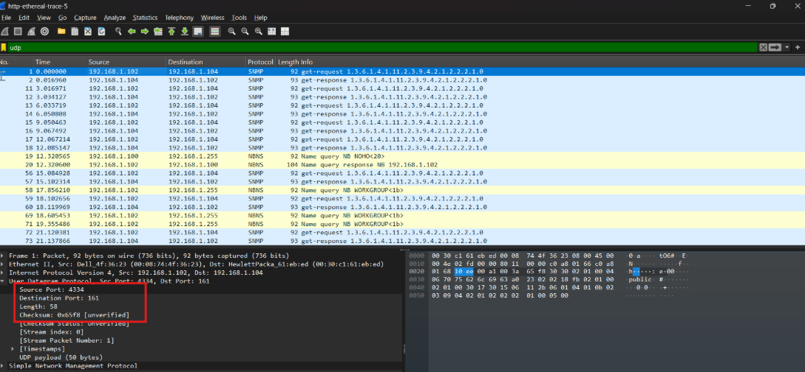
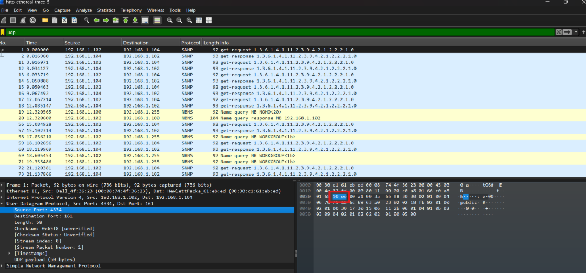
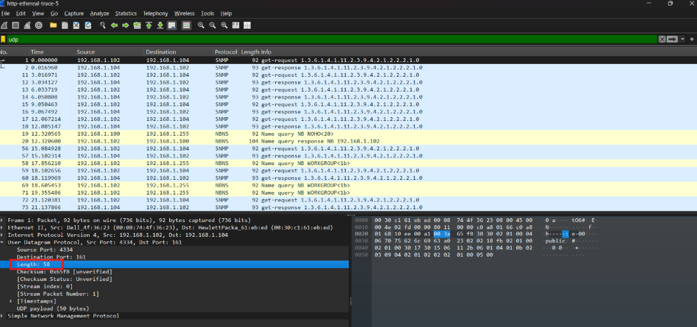
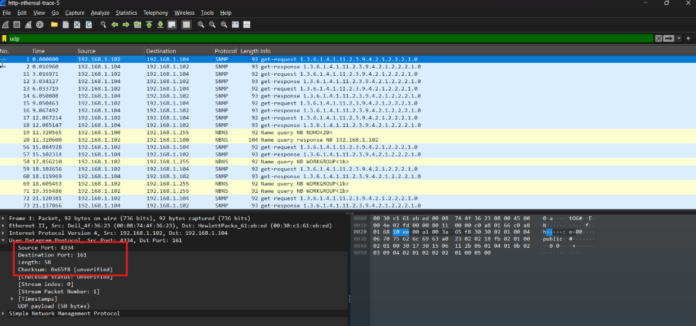
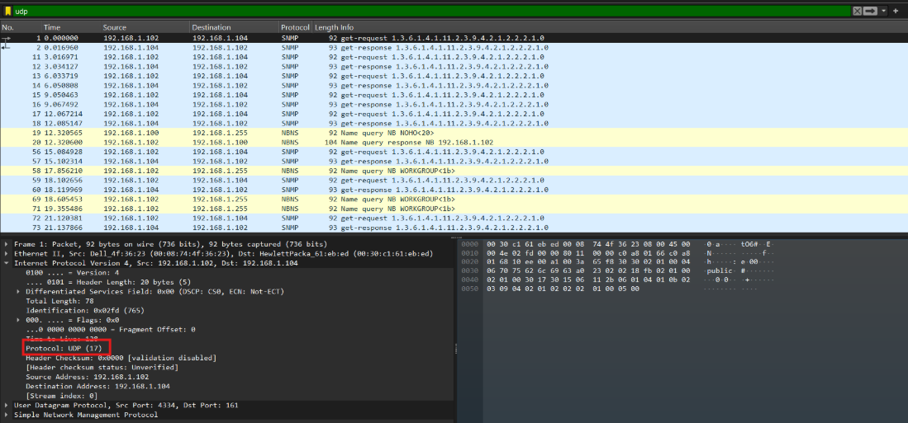
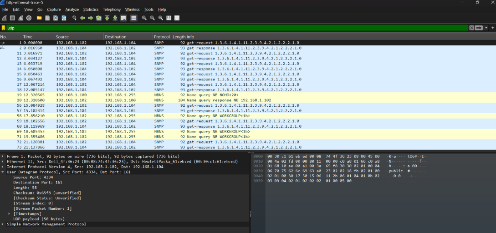
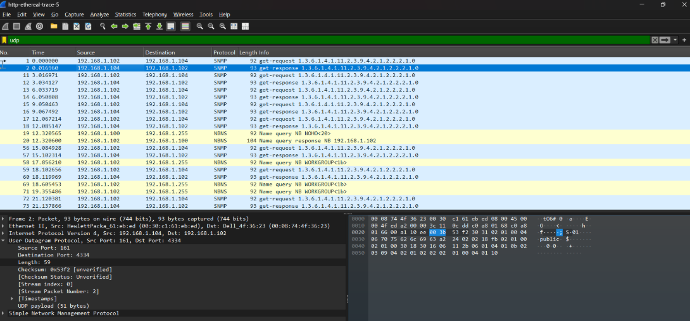

# LAPORAN PRAKTIKUM JARINGAN KOMPUTER  
## MODUL 4
## Pertanyaan
1. Pilih satu paket UDP yang terdapat pada trace Anda. Dari paket tersebut, berapa banyak 
“field” yang terdapat pada header UDP? Sebutkan nama-nama field yang Anda temukan! 
2. Perhatikan informasi “content field” pada paket yang Anda pilih di pertanyaan 1. Berapa 
panjang (dalam satuan byte) masing-masing “field” yang terdapat pada header UDP? 
3. Nilai yang tertera pada ”Length” menyatakan nilai apa? Verfikasi jawaban Anda melalui 
paket UDP pada trace. 
4. Berapa jumlah maksimum byte yang dapat disertakan dalam payload UDP? (Petunjuk: 
jawaban untuk pertanyaan ini dapat ditentukan dari jawaban Anda untuk pertanyaan 2) 
5. Berapa nomor port terbesar yang dapat menjadi port sumber? (Petunjuk: lihat petunjuk 
pada pertanyaan 4) 
6. Berapa nomor protokol untuk UDP? Berikan jawaban Anda dalam notasi heksadesimal dan 
desimal. Untuk menjawab pertanyaan ini, Anda harus melihat ke bagian ”Protocol” pada 
datagram IP yang mengandung segmen UDP. 
7. Periksa pasangan paket UDP di mana host Anda mengirimkan paket UDP pertama dan paket 
UDP kedua merupakan balasan dari paket UDP yang pertama. (Petunjuk: agar paket kedua merupakan balasan dari paket pertama, pengirim paket pertama harus menjadi tujuan dari 
paket kedua). Jelaskan hubungan antara nomor port pada kedua paket tersebut!

## Jawaban
1. Terdapat 4 field pada header UDP, yaitu:
- Source Port
- Destination Port
- Length
- Checksum

---

2. Panjang masing-masing field pada header UDP adalah sebagai berikut:
- Source Port: 2 byte
- Destination Port: 2 byte
- Length: 2 byte
- Checksum: 2 byte

---

3. Nilai yang tertera pada "Length" menyatakan panjang total dari header UDP dan payload (data) yang dikirimkan dalam paket tersebut. Dalam contoh ini, nilai "Length" adalah 58 byte, yang berarti bahwa header UDP (8 byte) dan payload (50 byte) bersama-sama memiliki panjang total 58 byte.

---

1. Langkah-langkah:

- - field Length berukuran 2 byte = 16 bit
- - Nilai maksimum dari 16 bit = 2¹⁶ - 1 = 65.535
- - Kurangi dengan ukuran header UDP

Max Payload = Nilai maksimum Length - Ukuran Header UDP

Max Payload = 65.535 - 8

Max Payload = 65.527 byte

Jadi payload UDP maksimal adalah 65.527 byte ≈ 64 KB

---

1. Port maksimum = 2¹⁶ - 1 = 65.535

---

1. Nomor protokol untuk UDP adalah 17 dalam notasi desimal dan 0x11 dalam notasi heksadesimal. Anda dapat melihat nomor protokol ini pada bagian "Protocol" pada datagram IP yang mengandung segmen UDP.

---

1. Dalam pasangan paket UDP, nomor port pada paket pertama (yang dikirimkan oleh host Anda) akan menjadi nomor port tujuan pada paket kedua (yang merupakan balasan). Sebaliknya, nomor port tujuan pada paket pertama akan menjadi nomor port sumber pada paket kedua. Hal ini menunjukkan bahwa komunikasi antara dua host menggunakan protokol UDP terjadi melalui pertukaran paket dengan nomor port yang saling terkait.

