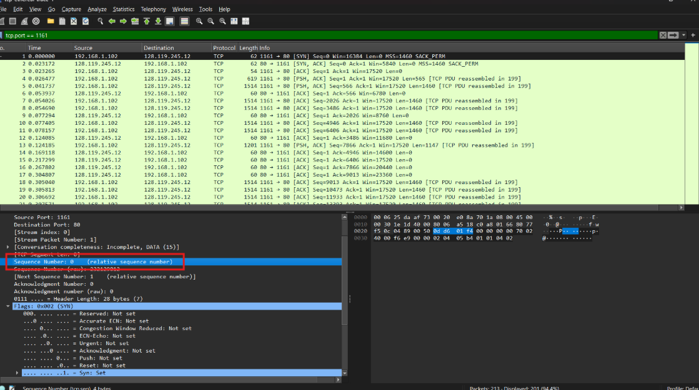
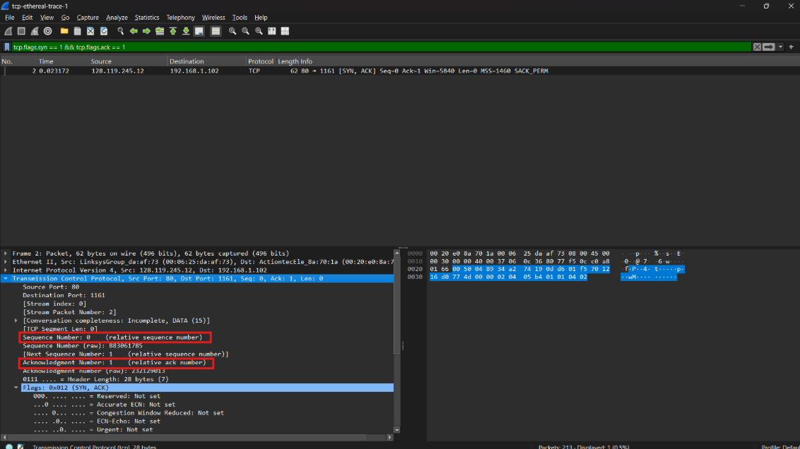
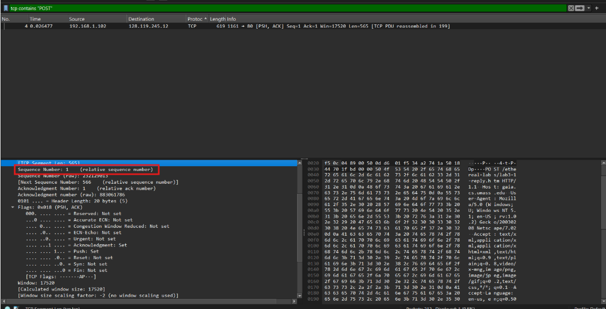
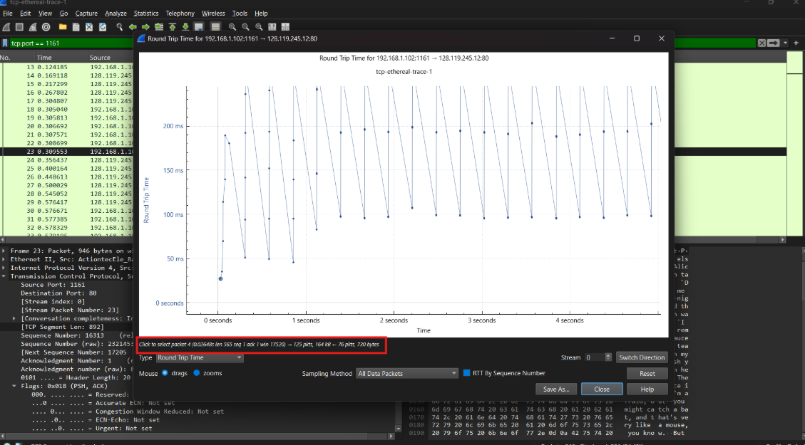
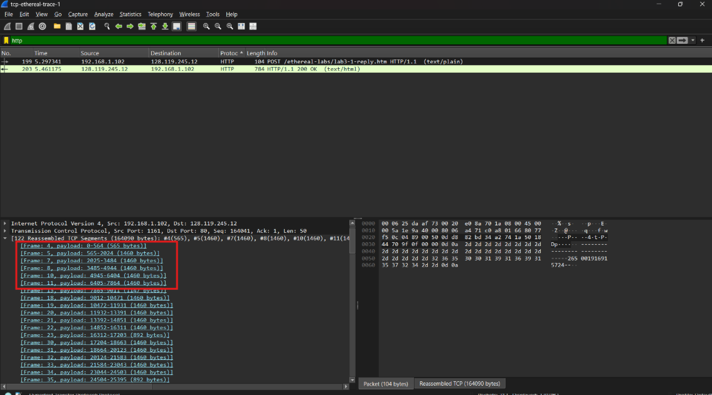
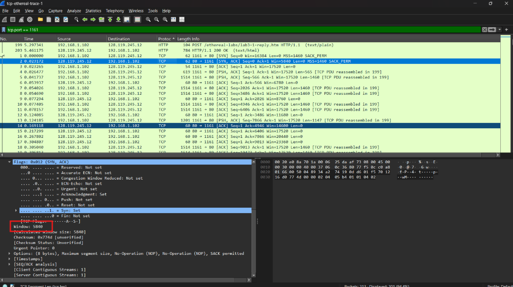
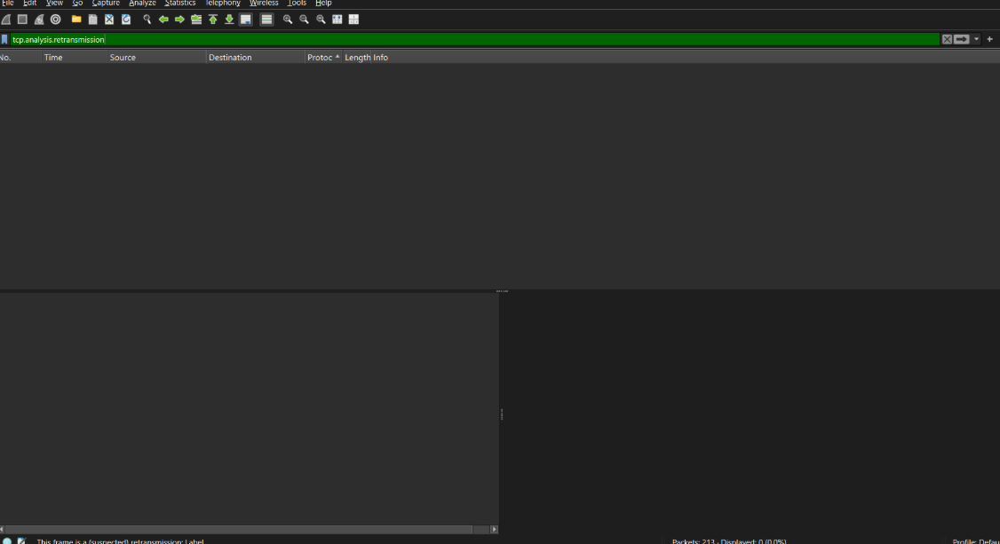
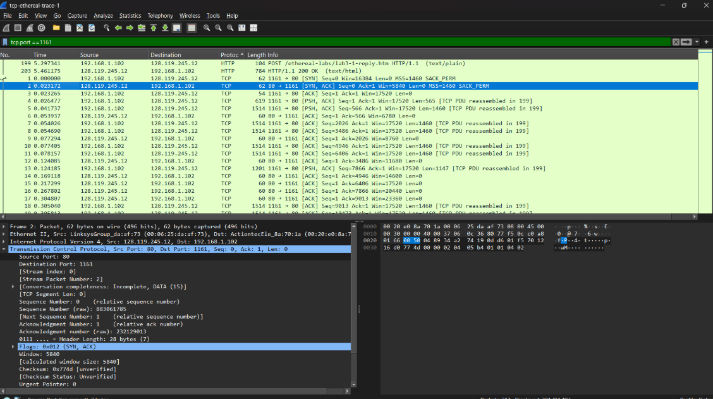
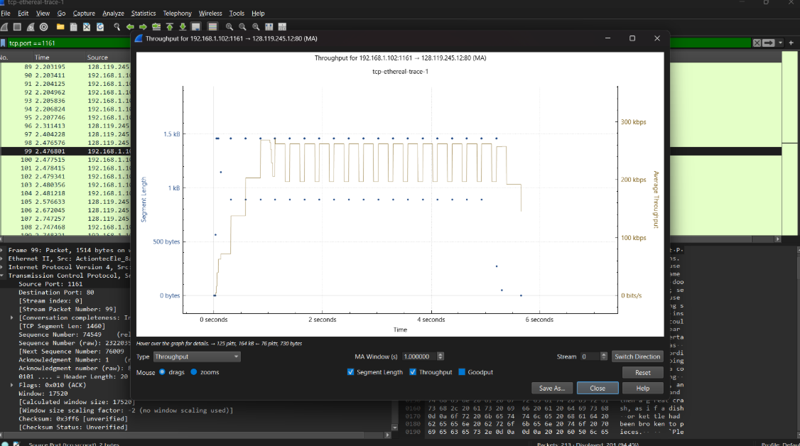
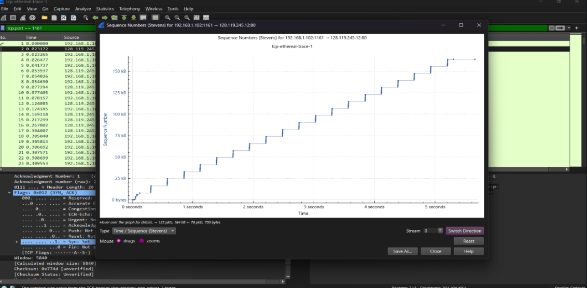

# Pertanyaan
1. Berapa nomor urut segmen TCP SYN yang digunakan untuk memulai sambungan TCP antara 
komputer klien dan gaia.cs.umass.edu? Apa yang dimiliki segmen tersebut sehingga 
teridentifikasi sebagai segmen SYN? 
2. Berapa nomor urut segmen SYNACK yang dikirim oleh gaia.cs.umass.edu ke komputer klien 
sebagai balasan dari SYN? Berapa nilai dari field Acknowledgement pada segmen SYNACK? 
Bagaimana gaia.cs.umass.edu menentukan nilai tersebut? Apa yang dimiliki oleh segmen  
sehingga teridentifikasi sebagai segmen SYNACK? 
3. Berapa nomor urut segmen TCP yang berisi perintah HTTP POST? Perhatikan bahwa untuk 
menemukan perintah POST, Anda harus menelusuri content field milik paket di bagian 
bawah jendela Wireshark, kemudian cari segmen yang berisi "POST" di bagian field DATA
nya. 
4. Anggap segmen TCP yang berisi HTTP POST sebagai segmen pertama dalam koneksi TCP. 
Berapa nomor urut dari enam segmen pertama dalam TCP (termasuk segmen yang berisi 
HTTP POST)? Pada jam berapa setiap segmen dikirim? Kapan ACK untuk setiap segmen 
diterima? Dengan adanya perbedaan antara kapan setiap segmen TCP dikirim dan kapan 
acknowledgement-nya diterima, berapakah nilai RTT untuk keenam segmen tersebut? 
Berapa nilai EstimatedRTT setelah penerimaan setiap ACK? (Catatan: Wireshark memiliki 
fitur yang memungkinkan Anda untuk memplot RTT untuk setiap segmen TCP yang dikirim. 
Pilih segmen TCP yang dikirim dari klien ke server gaia.cs.umass.edu pada jendela "daftar 
35 
JARINGAN KOMPUTER 
paket yang ditangkap". Kemudian pilih: Statistics->TCP Stream Graph- >Round Trip Time 
Graph). 
5. Berapa panjang setiap enam segmen TCP pertama? 
6. Berapa jumlah minimum ruang buffer tersedia yang disarankan kepada penerima dan 
diterima untuk seluruh trace? Apakah kurangnya ruang buffer penerima pernah 
menghambat pengiriman? 
7. Apakah ada segmen yang ditransmisikan ulang dalam file trace? Apa yang anda periksa (di 
dalam file trace) untuk menjawab pertanyaan ini? 
8. Berapa banyak data yang biasanya diakui oleh penerima dalam ACK? Dapatkah anda 
mengidentifikasi kasus-kasus di mana penerima melakukan ACK untuk setiap segmen yang 
diterima? 
9. Berapa throughput (byte yang ditransfer per satuan waktu) untuk sambungan TCP? 
Jelaskan bagaimana Anda menghitung nilai ini.
# Jawaban :
1.  

Segmen teridentifikasi sebagai SYN karena pada jendela detail header TCP, bit bendera (Flags) menunjukkan nilai Syn: Set, yang berarti bit SYN bernilai 1 sementara bit ACK bernilai 0.

---

2.

Nomor urut segmen SYNACK yang dikirim oleh gaia.cs.umass.edu adalah 0. Nilai dari field Acknowledgement pada segmen SYNACK adalah 1. Gaia.cs.umass.edu menentukan nilai tersebut dengan menambahkan 1 ke nomor urut segmen SYN yang diterima dari klien, yang dalam hal ini adalah 0 + 1 = 1. Segmen teridentifikasi sebagai SYNACK karena pada jendela detail header TCP, bit bendera (Flags) menunjukkan nilai Syn: Set dan Ack: Set, yang berarti bit SYN bernilai 1 dan bit ACK bernilai 1.

---

3.

Nomor urut segmen TCP yang berisi perintah HTTP POST adalah 1. Anda dapat menemukan perintah POST dengan menelusuri content field milik paket di bagian bawah jendela Wireshark, kemudian mencari segmen yang berisi "POST" di bagian field DATA-nya.

---

4.

Segmen pertama yang berisi HTTP POST (Frame 4) memiliki nomor urut 57273 dan dikirim pada detik 1.666151. Berdasarkan data pada grafik Round Trip Time, ACK untuk segmen ini diterima sekitar 0,02648 detik kemudian, sehingga waktu penerimaan ACK adalah detik 1.692631. Lima segmen berikutnya dikirim dengan nomor urut yang bertambah sesuai panjang data masing-masing segmen (misalnya, jika segmen pertama 565 byte, maka segmen kedua dimulai pada 57838). Nilai RTT untuk enam segmen pertama ini berfluktuasi antara 26 ms hingga 195 ms sebagaimana terlihat pada plot titik biru di grafik. Dari nilai SampleRTT tersebut, diperoleh nilai EstimatedRTT secara berturut-turut untuk memperhalus estimasi waktu tunggu transmisi, dimulai dari 0.02648 detik dan meningkat seiring dengan peningkatan beban trafik pada segmen-segmen awal.

---

5.

Panjang Segmen TCP 

- Segmen Pertama (Frame 4): Memiliki panjang sebesar 565 bytes. 

- Segmen Kedua (Frame 5): Memiliki panjang sebesar 1460 bytes. 

- Segmen Ketiga (Frame 7): Memiliki panjang sebesar 1460 bytes. 

- Segmen Keempat (Frame 8): Memiliki panjang sebesar 1460 bytes. 

- Segmen Kelima (Frame 10): Memiliki panjang sebesar 1460 bytes. 

- Segmen Keenam (Frame 11): Memiliki panjang sebesar 1460 bytes.

---

6.

Nilai window size menunjukkan kapasitas buffer penerima yaitu 5840 bytes. Dalam trace ini, tidak terlihat adanya indikasi bahwa kurangnya ruang buffer penerima menghambat pengiriman, karena tidak ada segmen yang ditransmisikan ulang atau adanya penurunan throughput yang signifikan.

---

7.

Dalam file trace ini, tidak terlihat adanya segmen yang ditransmisikan ulang.

---

8.

Dalam trace ini, sebagian besar ACK yang diterima mengakui sejumlah data yang cukup besar, seringkali sekitar 1460 bytes, yang menunjukkan bahwa penerima mengakui data dalam jumlah besar sekaligus. Namun, terdapat beberapa kasus di mana penerima melakukan ACK untuk setiap segmen yang diterima, terutama pada segmen-segmen awal yang memiliki panjang data lebih kecil (misalnya, segmen pertama dengan panjang 565 bytes). Hal ini dapat dilihat pada ACK yang diterima setelah segmen-segmen tersebut, di mana nilai Acknowledgement Number meningkat sesuai dengan jumlah data yang diakui

---

9.

Untuk menghitung throughput, kita dapat menggunakan rumus:
Throughput = Total Data Transferred / Total Time

# Congestion Control pada TCP

1. 
