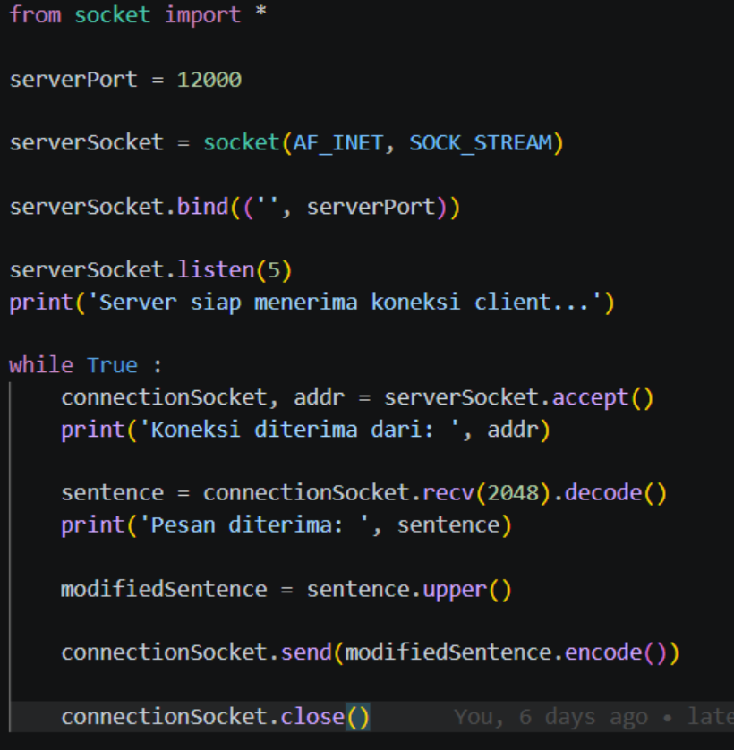
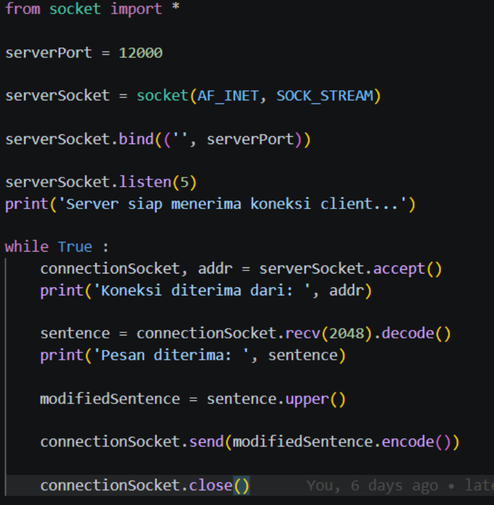
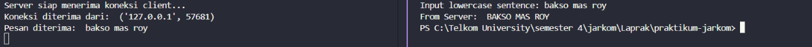

# Program Socket dengan TCP
# Client

1. Inisialisasi TCP Socket

- SOCK_STREAM: Inilah "tanda pengenal" bahwa kita menggunakan protokol TCP. Berbeda dengan UDP yang main kirim saja, TCP bersifat connection-oriented. Artinya, harus ada jabat tangan (handshake) di awal.

- clientSocket.connect((serverName, serverPort)): Ini baris yang paling penting. Sebelum bisa mengirim data, client harus membangun koneksi stabil ke server. Di balik layar, baris ini memicu proses TCP Three-Way Handshake.

---

1. Pengiriman Data yang Lebih Simpel

- clientSocket.send(sentence.encode()): Perhatikan bahwa di sini kita hanya menggunakan .send(), bukan .sendto().

- Kenapa tidak perlu alamat lagi? Karena koneksi sudah terjalin (sudah "nyambung" lewat telepon). Jadi, program sudah tahu persis ke mana data tersebut harus mengalir tanpa perlu dituliskan ulang alamat tujuannya setiap kali mengirim pesan.

---

1. Penerimaan Data

- clientSocket.recv(2048): Sama seperti pengiriman, fungsi terima datanya pun lebih sederhana. Kita tidak perlu menangkap serverAddress lagi karena dalam satu pipe (pipa) koneksi TCP ini, pengirimnya sudah pasti server yang kita connect tadi.

# Server

1. Inisialisasi dan Mendengarkan (Listen)

- SOCK_STREAM: Masih konsisten, ini menandakan penggunaan protokol TCP.

- serverSocket.listen(5): Ini bagian baru. Fungsi ini mengubah socket menjadi "pasif". Angka 5 adalah ukuran antrean (backlog). Artinya, server bisa menampung hingga 5 calon client yang mengantre untuk dilayani sebelum server mulai menolak koneksi baru.

---

1. Proses Jabat Tangan (Accept)

- connectionSocket, addr = serverSocket.accept(): Baris ini sangat sakral di TCP.

- - Saat ada client melakukan .connect(), baris ini akan "terbangun" dan menciptakan socket baru khusus untuk client tersebut (connectionSocket).

- - Penting: serverSocket tetap terjaga di pintu depan untuk menunggu tamu lain, sedangkan connectionSocket adalah jalur pribadi untuk mengobrol dengan tamu yang baru masuk.

---

1. Komunikasi Lewat Jalur Pribadi

- connectionSocket.recv(2048): Perhatikan bahwa server menerima data menggunakan connectionSocket, bukan serverSocket. Karena koneksi sudah terjalin secara eksklusif, server tidak perlu memanggil recvfrom untuk tahu siapa pengirimnya.

- connectionSocket.send(...): Begitu juga saat membalas. Server langsung mengirim ke jalur pribadi tersebut. Data otomatis sampai ke client yang tepat.

---

1. Menutup Jalur Pribadi

- connectionSocket.close(): Setelah satu transaksi selesai (terima, ubah jadi kapital, kirim balik), jalur pribadi ini ditutup. Namun, karena ini berada di dalam while True, server akan langsung naik lagi ke atas untuk menunggu accept() berikutnya.

# Output

