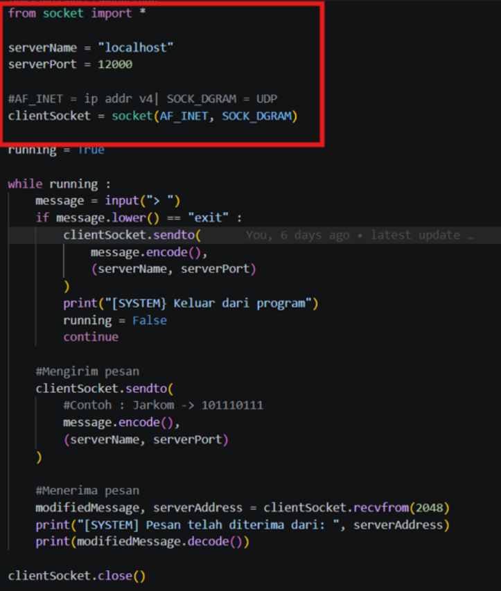
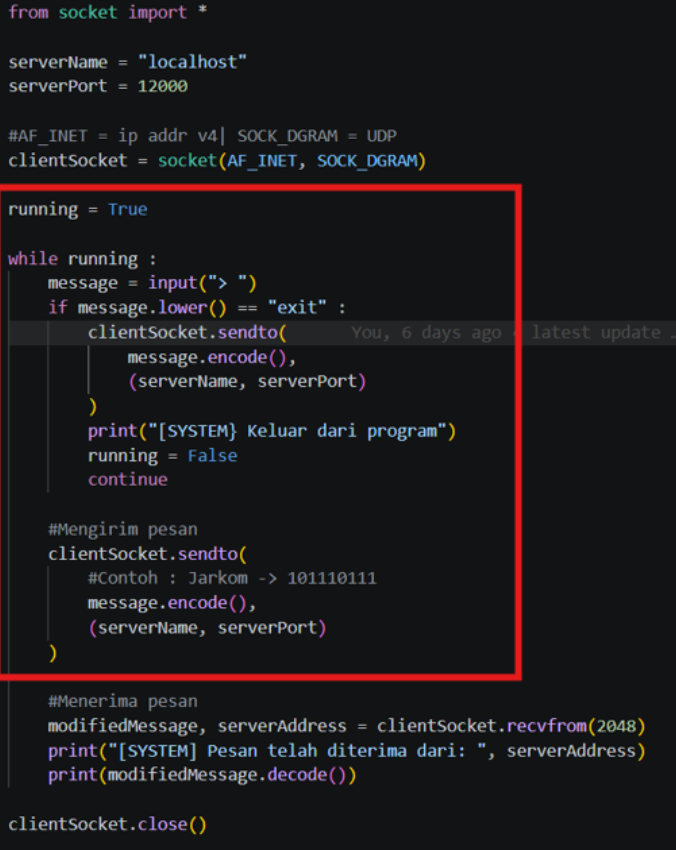
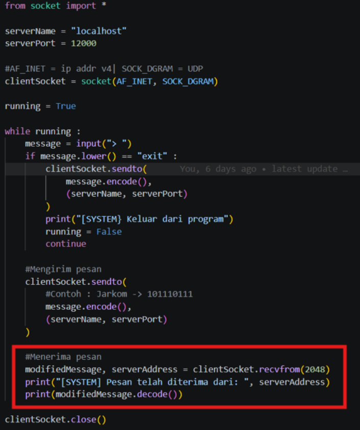
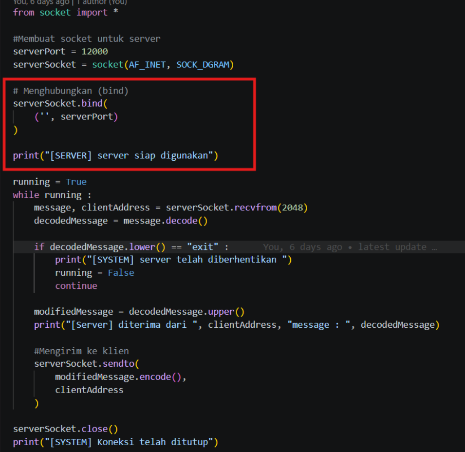
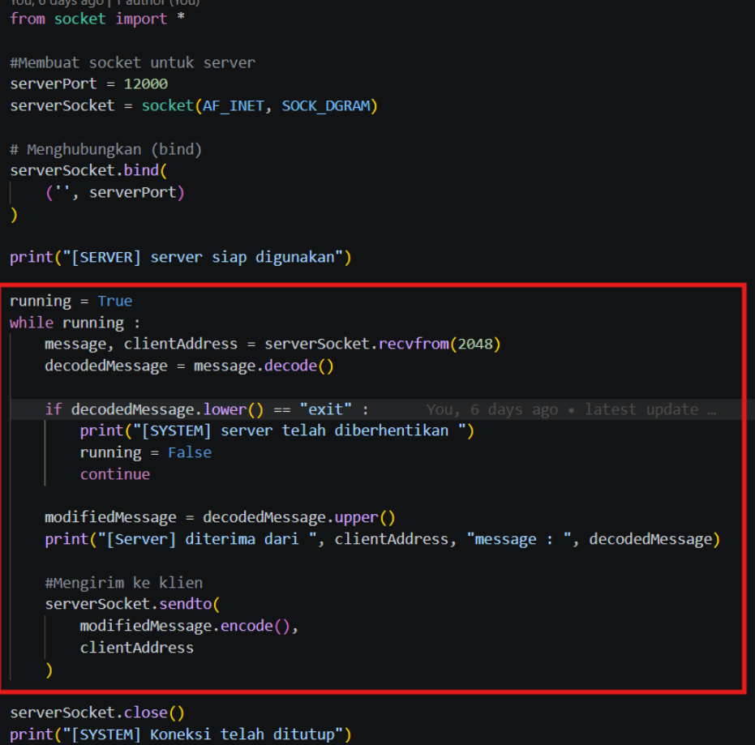
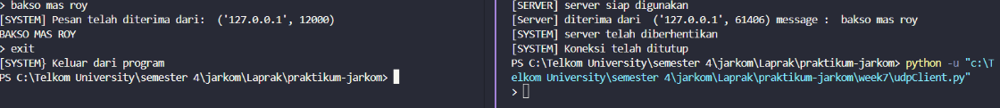

# Program Socket dengan UDP
# Client
1. Import dan Inisialisasi

Bagian ini adalah tahap persiapan agar program bisa berkomunikasi lewat jaringan.

- from socket import *: Mengimpor modul socket agar kita bisa menggunakan fungsi-fungsi jaringan.

- serverName = "localhost": Menentukan alamat server tujuan. "localhost" berarti server berada di komputer yang sama.

- serverPort = 12000: Menentukan "pintu" (port) mana yang akan diketuk pada server.

- clientSocket = socket(AF_INET, SOCK_DGRAM):

- - AF_INET: Menandakan kita menggunakan alamat IPv4.

- - SOCK_DGRAM: Menandakan bahwa koneksi ini menggunakan protokol UDP (bukan TCP). UDP bersifat connectionless, artinya data dikirim tanpa perlu membuat koneksi tetap terlebih dahulu.

---

1. Perulangan Utama dan Pengiriman Pesan

Bagian ini mengatur logika interaksi pengguna dan cara pengiriman datanya.

- while running :: Membuat program terus berjalan agar user bisa mengirim pesan berkali-kali.

- message = input("> "): Mengambil input teks dari keyboard user.

- if message.lower() == "exit" :: Logika untuk keluar. Jika user mengetik "exit", program akan memberi tahu server, lalu mengubah status running menjadi False untuk menghentikan perulangan.

- message.encode(): Sangat penting! Socket hanya bisa mengirim data dalam bentuk bytes (angka biner), bukan teks string biasa. Fungsi ini mengubah teks menjadi format byte agar bisa dikirim lewat kabel jaringan.

- sendto(...): Fungsi khusus UDP untuk mengirim data. Karena UDP tidak punya koneksi tetap, kita harus menyertakan isi pesan dan alamat tujuan (IP & Port) setiap kali mengirim sesuatu.

---

1. Penerimaan Balasan dari Server

Setelah mengirim pesan, client menunggu jawaban kembali dari server.

- clientSocket.recvfrom(2048): Fungsi ini membuat program "menunggu" (blocking) sampai ada data yang masuk.

- - 2048 adalah ukuran buffer, yaitu kapasitas maksimal data yang bisa diterima dalam satu waktu.

- - Fungsi ini mengembalikan dua hal: isi pesan (modifiedMessage) dan alamat pengirimnya (serverAddress).

- modifiedMessage.decode(): Kebalikan dari encode. Data byte yang diterima dari server diubah kembali menjadi teks string agar bisa dibaca manusia di layar monitor.

# Server

1. Menghubungkan (Bind)

Bagian bind adalah proses mengalokasikan port spesifik untuk program ini.

- serverSocket.bind(('', serverPort)):

-  - Tanda '' (string kosong) berarti server akan mendengarkan koneksi dari semua alamat IP yang tersedia di komputer tersebut (baik itu IP lokal maupun IP publik).

- - serverPort (12000) adalah pintu masuknya. Jika Client mengirim ke port 12000, maka kode inilah yang akan menangkap pesannya.

---

1. Perulangan Utama (Logika Pengolahan Pesan)

Ini adalah "jantung" dari server yang membuatnya terus aktif menunggu kiriman data.

- serverSocket.recvfrom(2048): Server berhenti di baris ini (standby) sampai ada Client yang mengirimkan data. Begitu data sampai, ia menangkap pesannya (message) dan mencatat siapa pengirimnya (clientAddress).

- - .decode() dan .upper():

- - - Pesan yang masuk didekode dari bytes ke teks.

- - - decodedMessage.upper() adalah logika manipulasi teks. Di sini, server diperintahkan untuk mengubah semua huruf menjadi HURUF KAPITAL.

- Logika "Exit": Jika client mengirim kata "exit", server akan mencetak pesan pemberhentian dan mengubah running = False untuk mematikan dirinya sendiri.

- serverSocket.sendto(...): Setelah teks diubah menjadi kapital dan di-encode kembali ke bytes, server mengirimkannya balik ke clientAddress.

- - Inilah alasan mengapa UDP disebut connectionless; server tahu ke mana harus membalas hanya karena ia baru saja menerima informasi clientAddress dari paket yang datang.

# Output

